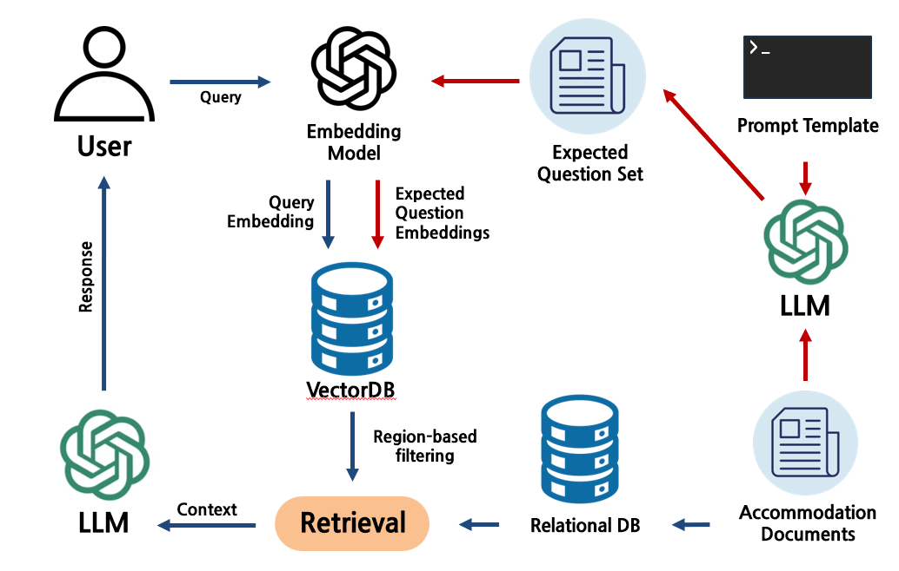
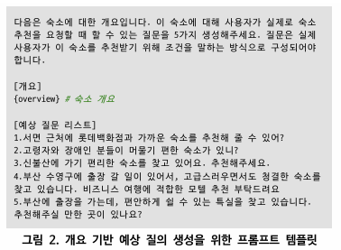
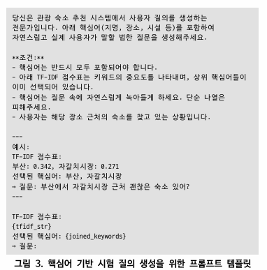

# 🧠 LLM 기반 질의 생성 및 RAG 기법을 활용한 숙박 추천 알고리즘 연구

## 📚 논문 개요

기존 숙박 플랫폼은 키워드 기반 필터링에 의존해 사용자 질의의 문맥적 요구사항을 제대로 반영하지 못한다는 한계가 존재합니다.  
본 연구는 **LLM을 활용한 질의 생성(QG)** 과 **RAG(Retrieval-Augmented Generation)** 구조를 결합하여 자연어 질의에 맞춘 고도화된 숙소 추천 시스템을 구현하고,  
기존 구조(개요 기반 벡터 검색)와 성능을 비교하여 **예상 질의 기반 벡터 임베딩 방식의 효과성**을 검증하였습니다.

---

## 🛠️ 실험 구조 및 기술 스택

| 구성 요소 | 기술 |
|-----------|------|
| 질의 생성 | OpenAI GPT-4o (`예상_질의_만들기.py`) |
| 고유명사 추출 | GPT-4o + TF-IDF (`고유명사_리스트.py`, `명사기반_핵심어_추출new.py`) |
| 추천 알고리즘 | LangChain + OpenAI LLM + Chroma VectorDB |
| 성능 평가 | 자동화된 Top-3 추천 + 포함 키워드 매칭 (`모델_평가.py`) |
| 비교 대상 | 기존: 숙소 개요 기반 RAG / 개선: 예상 질의 기반 RAG |
| 평가 기준 | Accuracy (포함된 핵심어 개수 기준 평가) |

---
## 🧠 RAG 기술 구조 및 프롬프트 템플릿
<!-- 첫 번째 이미지는 단독 -->
<p align="center">
 
</p>

<!-- 아래 두 이미지는 나란히 -->
<p align="center">
  <
  
</p>


## 🔄 시스템 흐름도
```
평가 질의
↓
OpenAI 임베딩
↓
(기존) 개요 기반 VectorDB or (개선) 예상 질의 기반 VectorDB
↓
Top-K 숙소 추출
↓
정형 숙소 정보 (Python Dict) 조회
↓
GPT-4o가 최종 숙소 3개 추천
```

---

## 🔬 실험 내용 및 방법

### ✅ 핵심어 기반 평가 질의 생성
- TF-IDF 기반 명사와 고유명사 리스트를 비교하여 필터링하여 핵심어 구성
- 포함 핵심어 개수에 따라 1~3개로 조절
- 총 300개 평가 질의 구성 (`평가_질의_만들기.py`)

### ✅ 두 가지 추천 알고리즘 비교

| 비교 항목 | 기존 방식 | 개선 방식 |
|-----------|-----------|------------|
| 벡터 구성 | 숙소 개요 기반 | 예상 질의 기반 |
| 검색 방식 | 사용자 질의 ↔ 개요 유사도 | 사용자 질의 ↔ 예상질의 유사도 |
| 문서 수 | 숙소 수와 동일 | 숙소당 5문서로 증가 |
| LLM 응답 | Top-K 숙소 중 최적 3개 추출 | 동일 방식 |

- 추천 코드:  
  - `논문버전_openai_api(top3).py` (예상 질의 기반)  
  - `논문버전_openai_api_비교군(top3).py` (개요 기반)

---

## 📈 성능 비교 결과 (Benchmark Dataset 기준)

| Benchmark Dataset | N=1 (Acc@1 / 3 / 5) | N=2 (Acc@1 / 3 / 5) | N=3 (Acc@1 / 3 / 5) |
|--------------------|----------------------|----------------------|----------------------|
| **Baseline**       | 0.40 / 0.48 / 0.49   | 0.35 / 0.46 / 0.50   | 0.35 / 0.42 / 0.46   |
| **Ours**           | **0.50 / 0.62 / 0.63** | **0.41 / 0.56 / 0.56** | **0.36 / 0.50 / 0.51** |

> 🔎 **Ours**는 LLM 기반 예상 질의 임베딩 방식,  
> **Baseline**은 기존 개요 기반 RAG 추천 알고리즘을 의미합니다.

---

## 📌 향후 활용 방향  
- 본 연구는 숙소 정보를 직접 임베딩하는 기존 방식의 한계를 보완하고자, **예상 질의 기반 임베딩** 전략을 제안하여 RAG 구조 내에서 **질의 간 의미적 연관성을 강화**함  
- 이를 통해 기존 개요 기반 방식 대비 **더 높은 추천 정확도**를 달성하였으며, 다양한 자연어 표현에도 **유연하게 대응 가능한 추천 시스템** 구현 가능성을 입증  
- 향후에는 해당 기술을 바탕으로, **고령층이나 디지털 환경에 익숙하지 않은 사용자**들도 직관적으로 사용할 수 있는 **자연어 기반 추천 서비스**로 확장 예정  
- 실제 사용자 피드백을 기반으로 한 **기술의 실증 테스트 및 응용 시스템 개발**을 통해 RAG 기반 질의응답 구조의 현실 적용 가능성을 높이고자 함

---

## 📁 주요 파일 구성

| 파일명 | 설명 |
|--------|------|
| `예상_질의_만들기.py` | 숙소 개요 → 예상 질의 5개 생성 |
| `고유명사_리스트.py` | 고유명사 추출 (GPT 기반) |
| `명사기반_핵심어_추출new.py` | TF-IDF 기반 핵심어 정제 |
| `평가_질의_만들기.py` | 평가용 질의 자동 생성 |
| `논문버전_openai_api(top3).py` | 예상질의 기반 RAG 추천 코드 |
| `논문버전_openai_api_비교군(top3).py` | 기존 개요 기반 RAG 추천 코드 |
| `모델_평가.py` | 자동 평가 및 정확도 분석 |

---

## 📝 논문 정보

- 논문 제목: **LLM 기반 질의 생성 및 RAG 기법을 활용한 숙박 추천 알고리즘 연구**
- 제출처: 한국정보과학회
- 내용: LLM을 활용한 추천 알고리즘 구조 고도화 및 정량적 비교 실험
- 문서: `manuscript_v1.0.pdf`

